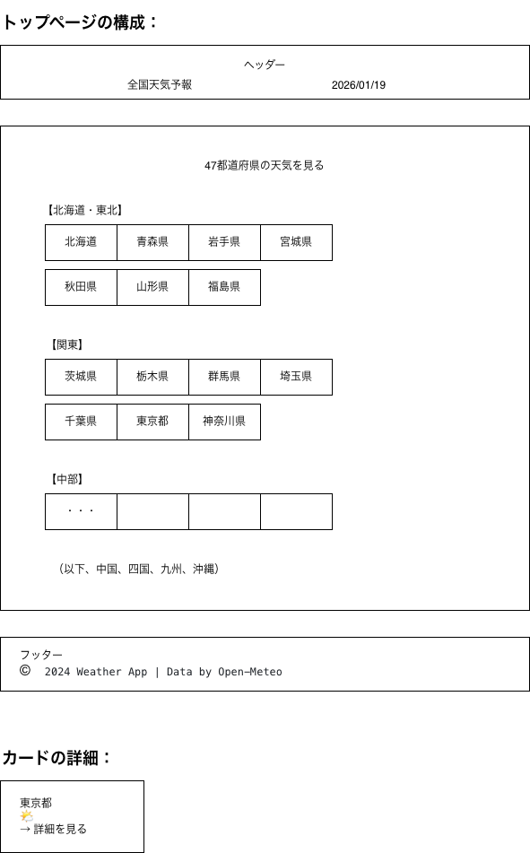
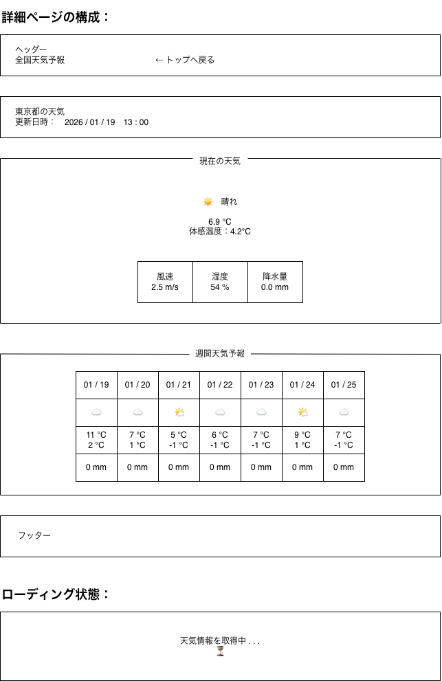

# 画面設計書

## プロジェクト情報
- プロジェクト名: 全国天気予報アプリ
- 作成日: 2026-01-19
- 作成者: [齋藤 すみれ]

---

## 画面一覧

| 画面ID | 画面名 | URL | 備考 |
|--------|--------|-----|------|
| HOME-001 | トップページ | / | 47都道府県一覧 |
| DETAIL-001 | 天気詳細 | /weather/{id} | 選択都道府県の天気 |
| ERROR-404 | 404エラー | /error/404 | - |
| ERROR-500 | 500エラー | /error/500 | - |

---

## HOME-001: トップページ

### 画面概要
47都道府県の一覧を表示し、クリックで詳細ページへ遷移

### ワイヤーフレーム


### 画面要素

#### ヘッダー
- アプリ名: 「全国天気予報」（H1タグ）
- 現在日時: リアルタイム表示

#### メインコンテンツ
- 地域ごとにグループ化
  - 北海道・東北
  - 関東
  - 中部
  - 関西
  - 中国
  - 四国
  - 九州・沖縄

- 都道府県カード（各都道府県）
  - 都道府県名
  - 簡易アイコン（任意）
  - ホバー効果: 背景色変更、カーソル変更

#### フッター
- コピーライト
- データ提供元: Open-Meteo

### レスポンシブ対応

| デバイス | カラム数 | カードサイズ |
|---------|---------|------------|
| スマホ | 1 | 100% |
| タブレット | 2-3 | 50% / 33% |
| PC | 4-5 | 25% / 20% |

### アクション
1. 都道府県カードクリック → `/weather/{prefectureId}` へ遷移

---

## DETAIL-001: 天気詳細ページ

### 画面概要
選択した都道府県の現在天気と週間予報を表示

### ワイヤーフレーム


### 画面要素

#### ヘッダー
- アプリ名
- 戻るリンク: トップページへ

#### 都道府県情報
- 都道府県名（H1タグ）
- 更新日時

#### 現在の天気
- 天気アイコン（大きく表示）
- 天気の説明
- 気温（大きく表示）
- 体感温度
- 詳細情報
  - 風速
  - 湿度
  - 降水量

#### 週間天気予報
- 7日間のカード
  - 日付
  - 天気アイコン
  - 最高気温
  - 最低気温
  - 降水量

#### ローディング
- API呼び出し中のスピナー表示

### レスポンシブ対応

| デバイス | 週間予報表示 |
|---------|-------------|
| スマホ | 縦スクロール、1カード/行 |
| タブレット | 横スクロール可能 |
| PC | 7カード横並び |

### アクション
1. 戻るボタン → トップページへ
2. お気に入りボタン（任意） → LocalStorageに保存

---

## 色彩設計

### カラーパレット
- プライマリ: #4A90E2（青）
- セカンダリ: #F5A623（オレンジ）
- 背景: #F8F9FA（ライトグレー）
- テキスト: #333333（ダークグレー）
- エラー: #E74C3C（赤）

### 天気アイコンの色
- 晴れ: #FFD700（ゴールド）
- 曇り: #B0B0B0（グレー）
- 雨: #4A90E2（ブルー）
- 雪: #E0F7FA（ライトブルー）

---

## フォント設計

### フォントファミリー
```css
font-family: 'Noto Sans JP', -apple-system, BlinkMacSystemFont, 'Segoe UI', sans-serif;
```

### フォントサイズ
- H1: 2rem (32px)
- H2: 1.5rem (24px)
- H3: 1.25rem (20px)
- 本文: 1rem (16px)
- 小さい文字: 0.875rem (14px)

---

## アクセシビリティ

### 対応項目
- [ ] キーボードナビゲーション
- [ ] ARIA属性の付与
- [ ] カラーコントラスト比 4.5:1以上
- [ ] alt属性の設定
- [ ] フォーカスインジケーター

---

## 画面遷移図

次のDay 9で作成予定
